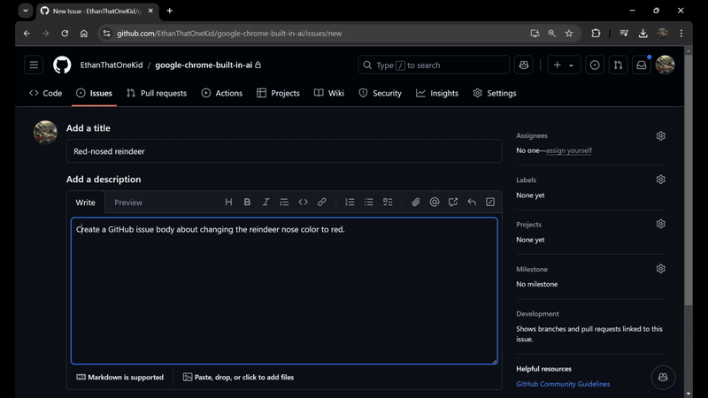

# In-Chrome AI



A Google Chrome Extension that provides AI-powered suggestions for text input
using [Gemini Nano](https://deepmind.google/technologies/gemini/nano/), Google's
language model in the browser.

This project is only one of the many possible applications of Chrome's built-in
AI capabilities. The extension is built using Deno and TypeScript. Read more on
our
[Devpost submission](https://devpost.com/software/google-chrome-built-in-ai-zyjaem).

## Development

Install Deno: <https://docs.deno.com/runtime/>

Format the source code:

```sh
deno fmt
```

Run the linter:

```sh
deno lint
```

Generate trial token for trial,
[Trial for Prompt API for Chrome Extensions](https://developer.chrome.com/origintrials/#/view_trial/320318523496726529).

Update the `.env` file with the generated token:

```sh
TRIAL_TOKEN_PROMPT_API_FOR_CHROME_EXTENSIONS=""
```

Generate [Gemini API key](https://aistudio.google.com/app/apikey) (acts as a
fallback solution when Gemini Nano is not available):

Update the `.env` file with the generated token:

```sh
GEMINI_API_KEY=""
```

Run the build command to bundle extension files in the `unpacked` directory:

```sh
deno task build
```

Load the unpacked extension in Google Chrome:

1. Open the Extension Management page by navigating to
   [`chrome://extensions`](chrome://extensions/).
   - The Extension Management page can also be opened by clicking on the Chrome
     menu, hovering over `More Tools` then selecting `Extensions`.
2. Enable Developer Mode by clicking the toggle switch next to Developer mode.
3. Click the `Load unpacked` button and select the extension directory.

## References

- <https://googlechromeai.devpost.com/resources>
- <https://developer.chrome.com/docs/extensions/develop/ui/context-menu>
- <https://developer.chrome.com/docs/extensions/ai/prompt-api>
- <https://developer.chrome.com/docs/ai/built-in>

---

Developed during the
[Google Chrome Built-in AI Challenge](https://googlechromeai.devpost.com/) by
[**@EthanThatOneKid**](https://etok.codes/)
